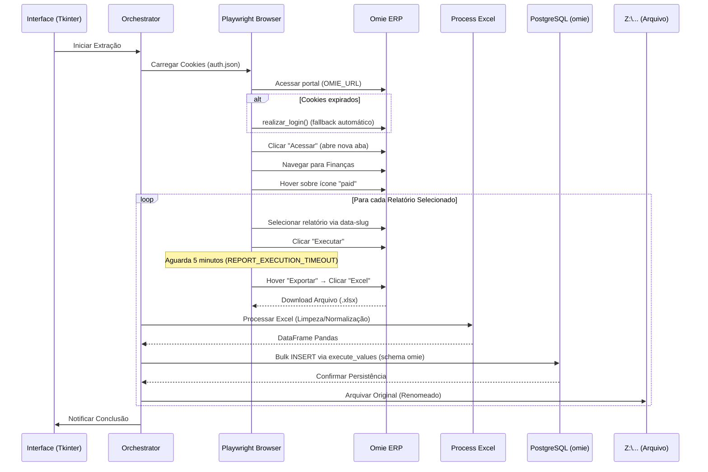

# Documentação Técnica - Bot Omie

> **Bot de automação (RPA) para extração, processamento e persistência de relatórios financeiros do ERP Omie.**

---

## 1. Visão Geral (High-Level Design)

### Objetivo
Automatizar a extração diária de relatórios financeiros críticos do Omie ERP, processá-los para normalização de dados e salvá-los em banco de dados PostgreSQL (schema `omie`) para análise posterior, além de arquivar os originais em rede corporativa.

### Padrão Arquitetural
O projeto segue uma arquitetura **Modular** baseada no projeto legado `bot_pso`, separando claramente as responsabilidades de extração, transformação e carga (ETL).

| Camada | Módulos | Descrição |
|--------|---------|-----------|
| **Presentation** | `gui.py` | Interface gráfica Desktop (Tkinter) para controle do usuário |
| **Orchestration** | `main.py` | Coordenador dos fluxos de navegação e processamento |
| **Authentication** | `auth.py` | Gestão de sessão, cookies e fallback de login automático |
| **Data Access** | `db.py`, `upsert_*.py` | Conexão com banco e persistência de dados (Upsert) |
| **Transformation** | `process_excel.py` | Leitura e limpeza de arquivos Excel (OpenPyXL/Pandas) |
| **Infrastructure** | `utils.py` | Operações de sistema de arquivos e rede |
| **Tooling** | `tools/get_selectors.py` | Ferramenta de descoberta de seletores via Playwright Inspector |

### Stack Tecnológico

| Componente | Tecnologia |
|------------|------------|
| **Linguagem** | Python 3.10+ |
| **Web Automation** | Playwright (Firefox, API síncrona) |
| **GUI** | Tkinter (Standard Lib) |
| **Processamento Dados** | Pandas + OpenPyXL |
| **Banco de Dados** | PostgreSQL 16 (`psycopg2-binary`, schema `omie`) |
| **Configuração** | python-dotenv |

---

## 2. Fluxos Principais

### 2.1 Fluxo de Autenticação (Híbrido)

O sistema implementa um modelo híbrido de autenticação para lidar com o 2FA do Omie:

1. **Primeira Execução (Manual):**
   - O browser abre visível (`headless=False`).
   - O usuário realiza login manual inserindo credenciais e token 2FA.
   - O bot captura o estado da sessão (cookies/storage) e salva em `auth.json`.

2. **Execuções Recorrentes (Automático):**
   - O bot carrega `auth.json`.
   - Injeta os cookies no browser (modo `headless=True`).
   - Acessa o sistema já autenticado, sem necessidade de nova intervenção humana.

3. **Fallback de Login Automático (`realizar_login`):**
   - Se os cookies expiraram e a página redireciona para login, o sistema entra no fluxo de fallback.
   - Preenche e-mail (`OMIE_USER`) → Clica "Continuar" → Preenche senha (`OMIE_PASSWORD`) → Clica "Entrar".
   - Aguarda `networkidle` e verifica login por indicadores (botão "Acessar", avatar, "Dashboard", "Meus Aplicativos").
   - Em caso de sucesso, salva os novos cookies em `auth.json`.

### 2.2 Fluxo de Extração e Processamento (ETL)



### 2.3 Constantes de Controle

| Constante | Valor | Descrição |
|-----------|-------|-----------|
| `MAX_RETRIES` | 3 | Tentativas por relatório antes de marcar como falha |
| `RETRY_DELAY` | 5s | Intervalo entre tentativas |
| `REPORT_EXECUTION_TIMEOUT` | 300s (5 min) | Tempo fixo de espera após clicar "Executar" |

---

## 3. Detalhamento dos Módulos

### 3.1 Orquestrador (`main.py`)
Centraliza a lógica de negócios e mapeamento dos relatórios. Define a lista `RELATORIOS` que vincula o nome no menu, o `data-slug` para seleção confiável, o arquivo esperado e o handler de banco de dados.

**Mapeamento Atual:**
| Menu Omie | Arquivo Excel | Tabela PostgreSQL | Data-Slug | Handler Upsert |
|-----------|--------------|-------------------|-----------|----------------|
| Contas a Pagar - PMO | `A PAGAR.xlsx` | `omie.a_pagar` | `rel-fin-custom-contas-a-pagar-pmo--5786318546` | `upsert_contas_a_pagar.py` |
| Notas Faturadas - PMO | `NF_FATURADAS.xlsx` | `omie.nf_faturadas` | `rel-fin-custom-notas-faturadas-pmo--5786322454` | `upsert_notas_faturadas.py` |
| Notas Debito - PMO | `NOTAS_DEBITO.xlsx` | `omie.notas_debito` | `rel-fin-custom-notas-debito-pmo--5786322433` | `upsert_notas_debito.py` |

**Funções Principais:**
- `fechar_popups(page)` — Detecta e fecha popups do Omie ("Depois", "Fechar", "Agora não").
- `navegar_para_financas(page)` — Navega até o módulo Finanças. **Importante:** clicar em "Acessar" abre uma nova aba; a função retorna a nova `Page`.
- `extrair_relatorio_omie(page, nome_menu, data_slug, arquivo)` — Extrai um relatório usando seletor CSS `[data-slug="..."]`.
- `processar_e_salvar(arquivo_path, tabela, upsert_handler)` — Processa Excel e persiste no banco.
- `run_extraction(relatorios_selecionados)` — Loop principal com lógica de retry.

### 3.2 Interface Gráfica (`gui.py`)
Classe `BotOmieGUI` com Tkinter, oferecendo:
- **Indicador de autenticação** — verde (autenticado) / vermelho (não autenticado).
- **Seleção de relatórios** — checkboxes com botões "Marcar Todos" / "Desmarcar Todos".
- **Extração automática por inatividade** — se o usuário não interagir por 10 segundos, a extração inicia automaticamente (se autenticado).
- **Auto-close** — quando `AUTO_CLOSE=true` no `.env`, a GUI fecha automaticamente 5 segundos após a conclusão.
- **Log em tempo real** — widget `ScrolledText` com handler customizado (`TextHandler`) que redireciona logs do Python.
- **Barra de progresso** — modo indeterminado durante a extração.
- **Threading** — operações de extração e configuração inicial rodam em threads separadas para não bloquear a UI.

### 3.3 Processamento de Excel (`actions/process_excel/process_excel.py`)
- **Detecção Dinâmica de Cabeçalho**: Identifica automaticamente em qual linha o cabeçalho começa, ignorando metadados do topo do relatório (busca a linha com mais valores string não-nulos).
- **Normalização**: Mantém os nomes de colunas **exatos** do Excel, aplicando apenas `strip()` de espaços. Não converte para `snake_case`.
- **Limpeza**: Remove linhas e colunas completamente vazias (`dropna`).

### 3.4 Persistência Dinâmica (`actions/upsert_data/*.py`)
Cada relatório tem seu próprio script de upsert, mas todos seguem o padrão:
1. **Create Table Dinâmico**: Cria a tabela no PostgreSQL (schema `omie`) baseada nas colunas presentes no DataFrame, inferindo tipos:
   - `INT` → `BIGINT`
   - `FLOAT` → `NUMERIC(15,2)`
   - `DATETIME` → `TIMESTAMP`
   - `STRING` → `VARCHAR(50-500)` baseado no comprimento máximo, ou `TEXT` se > 255 chars.
2. **Colunas automáticas**: `id` (`SERIAL` — auto-increment nativo do PostgreSQL), `created_at` (`TIMESTAMPTZ`), `updated_at` (`TIMESTAMPTZ` com trigger `set_updated_at()`).
3. **Bulk Insert**: Utiliza `psycopg2.extras.execute_values()` para inserção em lote (10-100x mais rápido que loop row-by-row).
4. **Conversão de tipos**: Valores `numpy` são convertidos para tipos Python nativos (`Decimal` para financeiros, `int` para inteiros, `None` para NaN).
5. **Identificadores com aspas duplas**: Colunas com espaços e caracteres especiais são envolvidas em `"..."` (padrão PostgreSQL).
6. **Arquivamento pós-insert**: Após sucesso, o arquivo é movido para o servidor de rede via `arquivar_arquivo()`.

### 3.5 Conexão com Banco (`db/db.py`)
- Connection pool thread-safe via `psycopg2.pool.ThreadedConnectionPool`.
- Pool configurado por `DB_POOL_MIN` e `DB_POOL_MAX` do `.env`.
- `_init_schema()` cria o schema `omie` e a função de trigger `set_updated_at()` automaticamente.
- `get_conn()` retorna uma conexão do pool; `release_conn(conn)` devolve ao pool.

### 3.6 Arquivamento (`utils.py`)
Responsável por mover os arquivos processados para o servidor de arquivos corporativo.
- **Caminho hardcoded**: `Z:\3-Corporativo\PMO\0-Gerência do PMO\6-Controles\8-Estruturação PMO\4 - Implementação\2 - Custos\Database`
- Renomeia o arquivo para `{table_name}.xlsx`.
- Remove arquivo destino existente antes de mover (Windows requer isso).

### 3.7 Ferramenta de Seletores (`tools/get_selectors.py`)
Abre um browser autenticado com o Playwright Inspector para descoberta interativa de seletores. Usar quando a interface do Omie mudar e os seletores CSS/`data-slug` precisarem ser atualizados.

```bash
python app/tools/get_selectors.py
```

---

## 4. Configuração e Instalação

### Pré-requisitos
- Python 3.10 ou superior
- PostgreSQL 16 (Hub PMO)
- Acesso à internet (`portal.omie.com.br`)
- Mapeamento de rede Z: ativo (para arquivamento)

### Instalação
1. Clone o repositório.
2. Crie e ative um ambiente virtual.
3. Instale as dependências:
   ```bash
   pip install -r requirements.txt
   playwright install firefox
   ```
4. Configure o arquivo `.env`:
   ```ini
   # PostgreSQL (Hub PMO)
   DB_HOST=<host_do_postgresql>
   DB_PORT=<porta>
   DB_NAME=pmo_hub
   DB_USER=pmo_admin
   DB_PASSWORD=<senha>
   DB_POOL_MAX=5
   DB_POOL_MIN=2

   # Credenciais Omie ERP
   OMIE_URL=https://portal.omie.com.br/meus-aplicativos
   OMIE_USER=seu_email@empresa.com
   OMIE_PASSWORD=sua_senha_omie

   # Comportamento da Aplicação
   AUTO_CLOSE=false
   ```

### Execução
```bash
# Interface gráfica (recomendado)
python app/gui.py

# Extração direta via CLI (requer auth.json)
python app/main.py

# Descoberta de seletores (quando a UI do Omie mudar)
python app/tools/get_selectors.py
```

---

## 5. Estrutura de Diretórios

```
bot_omie/
├── .env                        # Credenciais e configuração (não versionado)
├── auth.json                   # Sessão do navegador (não versionado)
├── requirements.txt            # Dependências Python
├── omie_bot.log                # Logs de execução
├── app/
│   ├── main.py                 # Core do robô (orquestrador)
│   ├── gui.py                  # Interface gráfica (Tkinter)
│   ├── auth.py                 # Lógica de login/cookies/fallback
│   ├── utils.py                # Utilitários de arquivo/rede
│   ├── db/
│   │   └── db.py               # Pool de conexões PostgreSQL
│   ├── downloads/              # Área temporária de downloads
│   ├── actions/
│   │   ├── process_excel/      # Leitor de Excel genérico
│   │   │   └── process_excel.py
│   │   └── upsert_data/        # Scripts de carga por tabela
│   │       ├── upsert_contas_a_pagar.py
│   │       ├── upsert_notas_debito.py
│   │       └── upsert_notas_faturadas.py
│   └── tools/
│       └── get_selectors.py    # Ferramenta de descoberta de seletores
```
