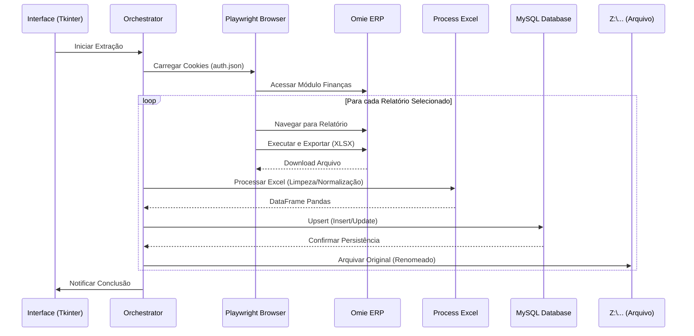

# Documentação Técnica - Bot Omie

> **Bot de automação (RPA) para extração, processamento e persistência de relatórios financeiros do ERP Omie.**

---

## 1. Visão Geral (High-Level Design)

### Objetivo
Automatizar a extração diária de relatórios financeiros críticos do Omie ERP, processá-los para normalização de dados e salvá-los em banco de dados MySQL para análise posterior, além de arquivar os originais em rede corporativa.

### Padrão Arquitetural
O projeto segue uma arquitetura **Modular** baseada no projeto legado `bot_pso`, separando claramente as responsabilidades de extração, transformação e carga (ETL).

| Camada | Módulos | Descrição |
|--------|---------|-----------|
| **Presentation** | `gui.py` | Interface gráfica Desktop (Tkinter) para controle do usuário |
| **Orchestration** | `main.py` | Coordenador dos fluxos de navegação e processamento |
| **Authentication** | `auth.py` | Gestão de sessão, cookies e bypass de 2FA |
| **Data Access** | `db.py`, `upsert_*.py` | Conexão com banco e persistência de dados (Upsert) |
| **Transformation** | `process_excel.py` | Leitura e limpeza de arquivos Excel (OpenPyXL/Pandas) |
| **Infrastructure** | `utils.py` | Operações de sistema de arquivos e rede |

### Stack Tecnológico

| Componente | Tecnologia |
|------------|------------|
| **Linguagem** | Python 3.10+ |
| **Web Automation** | Playwright (Firefox) |
| **GUI** | Tkinter (Standard Lib) |
| **Processamento Dados** | Pandas + OpenPyXL |
| **Banco de Dados** | MySQL 8.x (`mysql-connector-python`) |
| **Configuração** | python-dotenv |

---

## 2. Fluxos Principais

### 2.1 Fluxo de Autenticação (Híbrido)

O sistema implementa um modelo híbrido de autenticação para lidar com o 2FA do Omie:

1. **Primeira Execução (Manual):**
   - O browser abre visível (`headless=False`).
   - O usuário realiza login manual inserindo credenciais e token 2FA.
   - O bot captura o estado da sessão (cookies/storage) e salva em `auth.json`.

2. **Execuções Recorrentes (Automático):**
   - O bot carrega `auth.json`.
   - Injeta os cookies no browser.
   - Acessa o sistema já autenticado, sem necessidade de nova intervenção humana.

### 2.2 Fluxo de Extração e Processamento (ETL)



---

## 3. Detalhamento dos Módulos

### 3.1 Orquestrador (`main.py`)
Centraliza a lógica de negócios e mapeamento dos relatórios. Define a lista `RELATORIOS` que vincula o nome no menu, o arquivo esperado e o handler de banco de dados.

**Mapeamento Atual:**
| Menu Omie | Tabela Destino | Handler Upsert |
|-----------|----------------|----------------|
| Contas a Pagar - PMO | `OMIE_CONTAS_A_PAGAR` | `upsert_contas_a_pagar.py` |
| Notas Faturadas - PMO | `OMIE_NOTAS_FATURADAS` | `upsert_notas_faturadas.py` |
| Notas Debito - PMO | `OMIE_NOTAS_DEBITO` | `upsert_notas_debito.py` |

### 3.2 Processamento de Excel (`actions/process_excel/process_excel.py`)
Substitui o antigo processamento de CSV.
- **Detecção Dinâmica de Cabeçalho**: Identifica automaticamente em qual linha o cabeçalho começa, ignorando metadados do topo do relatório.
- **Normalização**: Converte nomes de colunas para `snake_case` (ex: "Data de Emissão" -> `data_de_emissao`) facilitando a criação de tabelas no banco.

### 3.3 Persistência Dinâmica (`actions/upsert_data/*.py`)
Cada relatório tem seu próprio script de upsert, mas todos seguem o padrão:
1. **Create Table Dinâmico**: Cria a tabela no MySQL baseada nas colunas presentes no DataFrame, inferindo tipos (INT, DECIMAL, DATETIME, VARCHAR).
2. **Upsert Idempotente**: Utiliza `INSERT ... ON DUPLICATE KEY UPDATE` para permitir reprocessamento sem duplicar registros.

### 3.4 Arquivamento (`utils.py`)
Responsável por mover os arquivos processados para o servidor de arquivos corporativo.
- **Caminho Configurado**: `Z:\3-Corporativo\PMO\0-Gerência do PMO\6-Controles\8-Estruturação PMO\4 - Implementação\2 - Custos\Database`

---

## 4. Configuração e Instalação

### Pré-requisitos
- Python 3.10 ou superior
- MySQL Server
- Acesso à internet (app.omie.com.br)
- Mapeamento de rede Z: ativo

### Instalação
1. Clone o repositório.
2. Crie e ative um ambiente virtual.
3. Instale as dependências:
   ```bash
   pip install -r requirements.txt
   playwright install firefox
   ```
4. Configure o arquivo `.env` (use `.env.example` como base):
   ```ini
   DB_HOST=localhost
   DB_USER=seu_usuario
   DB_PASSWORD=sua_senha
   DB_NAME=omie_db
   ```

### Execução
Para abrir a interface gráfica:
```bash
python app/gui.py
```

---

## 5. Estrutura de Diretórios

```
bot_omie/
├── .env                        # Credenciais (não versionado)
├── auth.json                   # Sessão do navegador (não versionado)
├── requirements.txt            # Dependências Python
├── omie_bot.log                # Logs de execução
├── app/
│   ├── main.py                 # Core do robô
│   ├── gui.py                  # Interface gráfica
│   ├── auth.py                 # Lógica de login/cookies
│   ├── utils.py                # Utilitários de arquivo/rede
│   ├── db/
│   │   └── db.py               # Conexão MySQL
│   ├── downloads/              # Área temporária de downloads
│   └── actions/
│       ├── process_excel/      # Leitor de Excel genérico
│       └── upsert_data/        # Scripts de carga por tabela
│           ├── upsert_contas_a_pagar.py
│           ├── upsert_notas_debito.py
│           └── upsert_notas_faturadas.py
```
